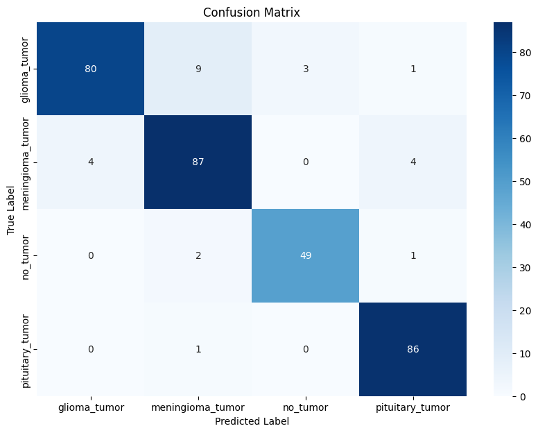
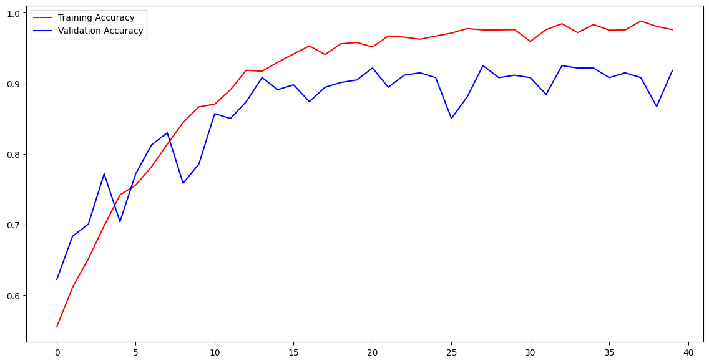
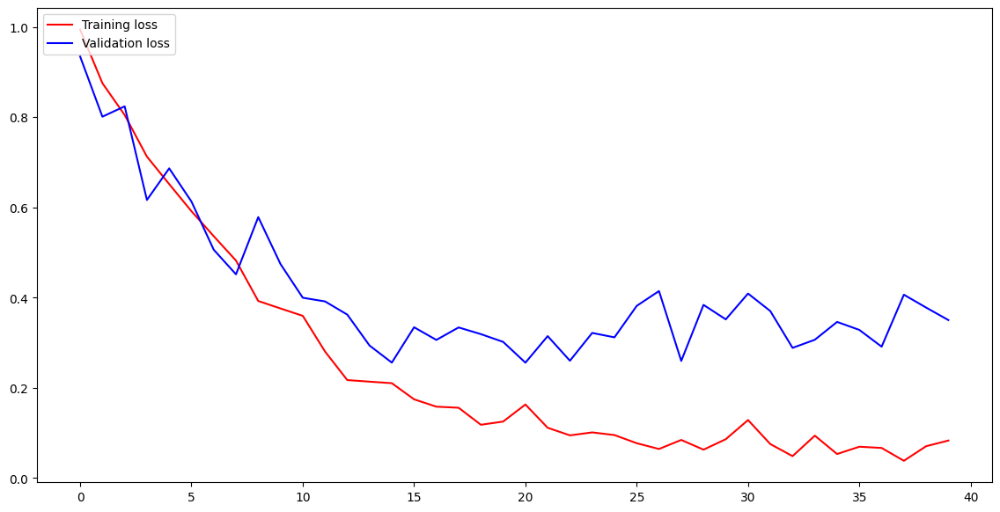

# Brain Tumor Detection & Classification using CNN

## Project Overview

The "Brain Tumor Detection & Classification using CNN" project leverages Convolutional Neural Networks (CNNs) to accurately detect and classify brain tumors from MRI images. The CNN model has achieved an impressive accuracy of **95%**, demonstrating its effectiveness in distinguishing between different types of brain tumors.

## Dataset

The dataset used for this project is sourced from Kaggle and can be accessed via the following link:

- [Brain Tumor Classification MRI Dataset](https://www.kaggle.com/datasets/sartajbhuvaji/brain-tumor-classification-mri)

This dataset contains MRI images categorized into four types of brain tumors:
1. Glioma Tumor
2. Meningioma Tumor
3. No Tumor
4. Pituitary Tumor

## Convolutional Neural Network (CNN)

Convolutional Neural Networks (CNNs) are a class of deep learning models specifically designed for processing structured grid data, such as images. They use convolutional layers to automatically and adaptively learn spatial hierarchies of features from input images. Key components of CNNs include:

- **Convolutional Layers**: Extract features by applying filters to the input image.
- **Pooling Layers**: Reduce the spatial dimensions of the feature maps, leading to a decrease in the number of parameters and computation.
- **Flattening**: Converts the pooled feature maps into a 1D vector.
- **Fully Connected Layers**: Perform the final classification based on the features extracted by convolutional layers.

## Execution

The project implementation is available in the Jupyter notebook:

- [BrainTumorDetection.ipynb](link-to-your-notebook)

## Results

### Confusion Matrix

The confusion matrix below provides a detailed view of the classification performance of the CNN model.

### Training & Validation Accuracy

The plot shows the accuracy of the model during the training and validation phases. The model's accuracy improves over epochs, demonstrating effective learning and generalization.

### Training & Validation Loss

The loss curve illustrates how the model's loss decreases over epochs for both training and validation sets. A decreasing loss indicates that the model is learning and fitting the data well.

## Model Files

- **`braintumor.h5`**: Trained CNN model saved in HDF5 format.
- **`my_model.keras`**: Trained CNN model saved in Keras format.

## Advantages of the Project

- **High Accuracy**: Achieved a 95% accuracy rate, demonstrating the model's reliability in detecting and classifying brain tumors.
- **Automated Detection**: Provides an automated solution for brain tumor classification, which can assist radiologists and medical professionals.
- **Scalable**: The model can be further improved and scaled to include more tumor types or different imaging modalities.

## Author

**Arun Kumar Sah**

## Copyright

© 2024 Arun Kumar Sah. All rights reserved.

## References

- [GitHub Repository](https://github.com/arunsah10/Brain-Tumor-Detection-Classification)
